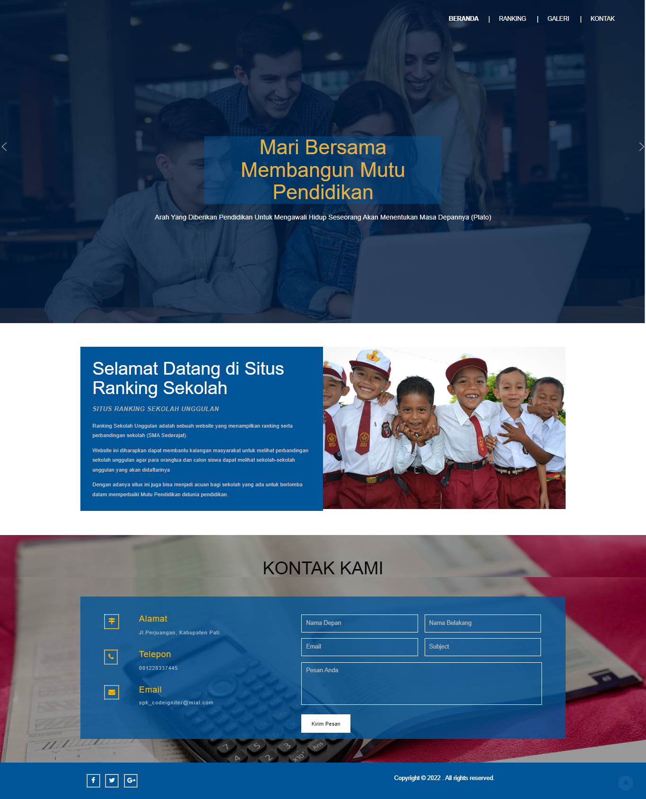
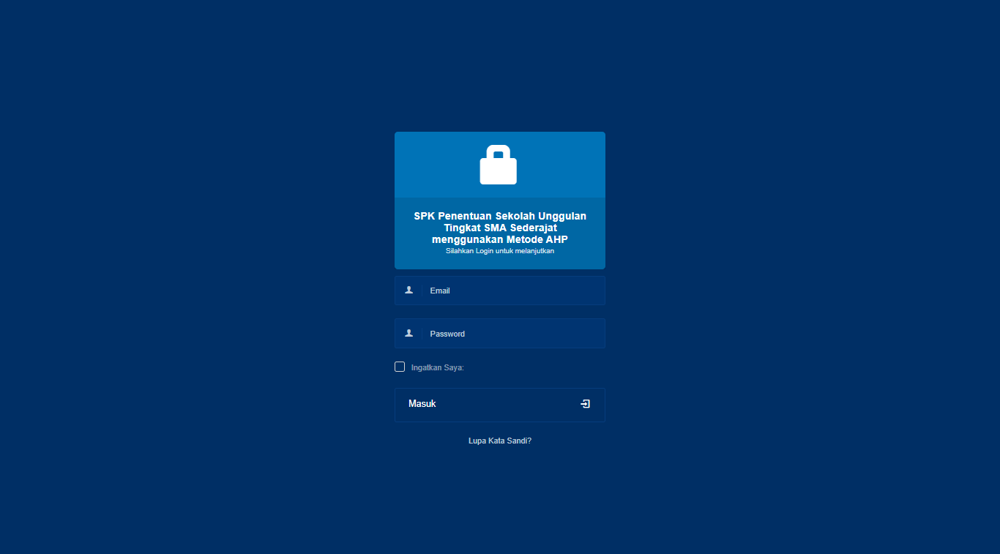
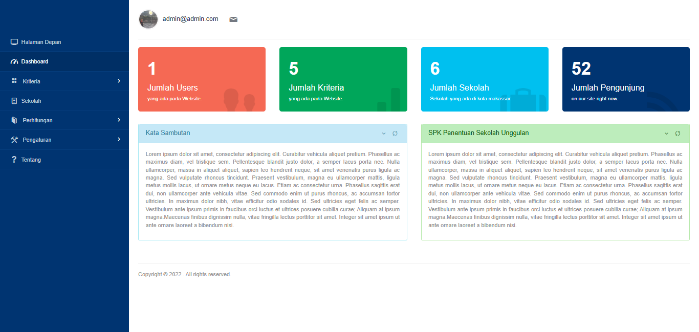
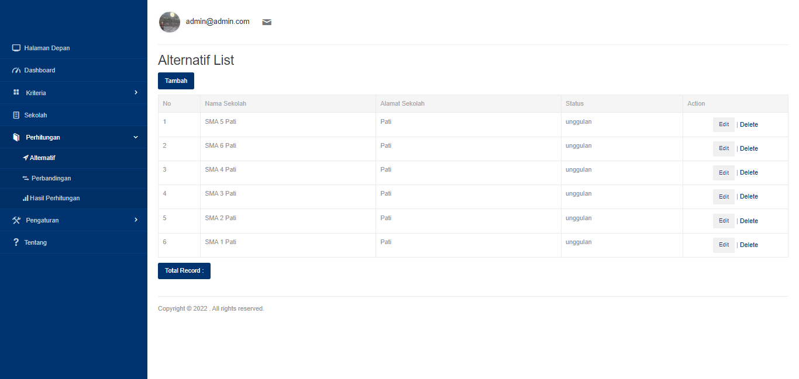
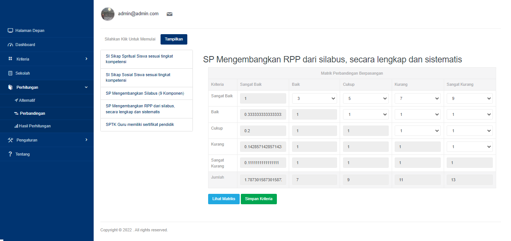
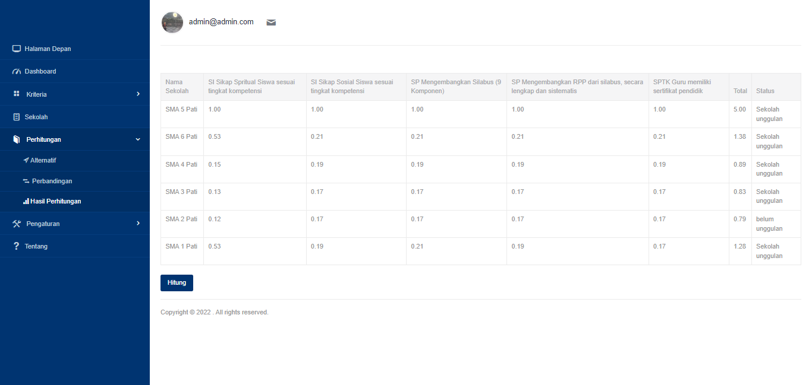

# Sistem Pendukung Keputusan metode AHP menggunakan Framework Codeigniter
Sistem Pendukung Keputusan Penentuan Sekolah Unggulan Tingkat SMA Sederajat Menggunakan Metode Analytical Hierarchy Process adalah sebuah sistem yang bertujuan untuk membuat peringkingan Sekolah-sekolah menegah atas. Tentu output atau keluaran dari sistem ini hanya sebagai rekomendasi dan perbandingan saja karena untuk pemberian nama sekolah unggulan tentu merupakan hak dan wewenang Pemerintah dalam hal ini Dinas Pendidikan dimana sekolah tersebut memiliki beberapa kriteria yang akan menentukan bahwa sekolah tersebut bisa dikatakan sebagai sekolah unggulan. Sistem ini dibangun menggunakan Framework PHP Codeigniter dan Framework CSS Bootstrap serta didukung oleh bahasa Pemrograman Java. Sistem ini masih memiliki banyak kekurangan sehingga besar harapan Pengembang untuk mendapatkan masukan-masukan yang bisa membuat sistem ini bisa lebih baik lagi.
<b>Semoga Bermanfaat.</b>

## Tampilan Aplikasi

## Admin Account
|   Level   |      Username      |  Password   |
|:---------:|:------------------:|:-----------:|
| Admin     |  admin@admin.com   |  password   |

## Sistem Requirement
- CodeIgniter
- Database MySQL
- XAMPP / PHP 5.6

